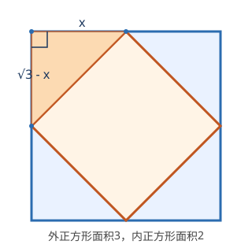

今日学段：**代数 + 几何**（AMC 10/12 难度）

题目来源：AMC 10 竞赛真题（美国数学协会 MAA 主办，高中级别）

---

## 【代数】Ted 的指数笔误

**难度：** ⭐⭐⭐（高中竞赛 · 指数与方程）

**题目来源：** [2022 AMC 10A Problem 11](https://wiki.randommath.com/amc10/2022/part-a/problem-11)

**知识点：** 指数运算 · 有理指数 · 一元二次方程

**题目：**

Ted 把 $2^{m} \cdot \sqrt{\dfrac{1}{4096}}$ 误写成了 $2 \cdot \sqrt[m]{\dfrac{1}{4096}}$。
问：当这两个表达式的值相等时，所有实数 $m$ 的和是多少？

---

### 解题过程

1. 注意到 $4096 = 2^{12}$，于是
   $$2^{m} \cdot \sqrt{\dfrac{1}{4096}} = 2^{m} \cdot (2^{-12})^{1/2} = 2^{m-6}.$$

2. 误写后的表达式化为
   $$2 \cdot \sqrt[m]{\dfrac{1}{4096}} = 2 \cdot (2^{-12})^{1/m} = 2^{1-\frac{12}{m}}.$$

3. 两式相等等价于指数相等：
   $$m - 6 = 1 - \frac{12}{m}.$$

4. 两边同乘 $m$，移项并因式分解：
   $$m^2 - 6m = m - 12 \quad\Rightarrow\quad m^2 - 7m + 12 = 0 \quad\Rightarrow\quad (m-3)(m-4)=0.$$

5. 解得 $m=3$ 或 $m=4$，其和为 $3+4 = 7$。

**答案：** $\boxed{7}$（对应选项 C）

---

### 常见错误

- 把 $(2^{-12})^{1/m}$ 错算成 $2^{-12m}$（指数相乘而非相除），导致方程错误。
- 误以为 $m$ 可以为 0（分母含 $m$），但本题解本身不含 0，无需额外排除。
- 求和时只写 $m$ 的某一个值，题目要求的是「所有实数解的和」。

---

### 知识背景

指数运算法则 $(a^p)^q=a^{pq}$ 是高中代数的基石。当指数出现变量（如有理指数 $1/m$）时，常通过「令两边底数相同、比较指数」将问题转化为代数方程。本题把指数与一元二次方程结合，是 AMC 10 中典型的「先化简、再解方程」题型，关键是把根号统一写成 2 的幂。

---

## 【几何】正方形内接正方形

**难度：** ⭐⭐⭐（高中竞赛 · 平面几何 · 勾股定理）

**题目来源：** [2023 AMC 10A Problem 11](https://wiki.randommath.com/amc10/2023/part-a/problem-11)

**知识点：** 勾股定理 · 旋转对称 · 一元二次方程

**题目：**

一个面积为 $2$ 的正方形内接于一个面积为 $3$ 的正方形中，四个角各形成一个全等的直角三角形（如下图所示）。问：阴影直角三角形中较短直角边与较长直角边的比是多少？

---

### 解题过程

1. 外正方形面积为 $3$，故其边长为 $\sqrt{3}$；内正方形面积为 $2$，故其边长为 $\sqrt{2}$，即斜放的直角三角形的斜边为 $\sqrt{2}$。

2. 设阴影直角三角形的较短直角边为 $x$，则由对称性，较长直角边为 $\sqrt{3}-x$。

3. 由勾股定理：
   $$x^{2} + (\sqrt{3}-x)^{2} = 2.$$

4. 展开并化简：
   $$x^{2} + 3 - 2\sqrt{3}x + x^{2} = 2 \quad\Rightarrow\quad 2x^{2} - 2\sqrt{3}x + 1 = 0.$$

5. 用求根公式：
   $$x = \frac{2\sqrt{3} \pm \sqrt{12-8}}{4} = \frac{1}{2}(\sqrt{3} \pm 1).$$
   即两直角边分别为 $\frac{1}{2}(\sqrt{3}-1)$ 与 $\frac{1}{2}(\sqrt{3}+1)$。

6. 所求比值为
   $$\frac{\frac{1}{2}(\sqrt{3}-1)}{\frac{1}{2}(\sqrt{3}+1)} = \frac{\sqrt{3}-1}{\sqrt{3}+1} = 2-\sqrt{3}.$$

**答案：** $\boxed{2-\sqrt{3}}$（对应选项 E）

---

### 常见错误

- 误以为内正方形边长是外正方形边长的一半，忽略「面积比 = 边长比的平方」。
- 设错变量：把两条直角边都设为未知量，导致多变量联立复杂化；其实利用对称性只需一个变量。
- 有理化时算错：$\dfrac{\sqrt{3}-1}{\sqrt{3}+1}$ 分子分母同乘 $(\sqrt{3}-1)$ 应得 $\dfrac{4-2\sqrt{3}}{2}=2-\sqrt{3}$。

---

### 知识背景

「正方形内接正方形」是经典的旋转对称几何模型：四个角上的直角三角形全等，且四组直角边之和恰好等于外正方形边长。本题将几何图形与代数（勾股定理 + 一元二次方程）紧密结合，体现了 AMC 竞赛「以形助数、以数解形」的命题风格。这类题的关键是找到不变量（此处为外正方形边长 $\sqrt{3}$ 与斜边 $\sqrt{2}$）。

---

*题目均来自 AMC 10 官方竞赛真题（MAA），经翻译与排版整理，仅供学习交流。*
