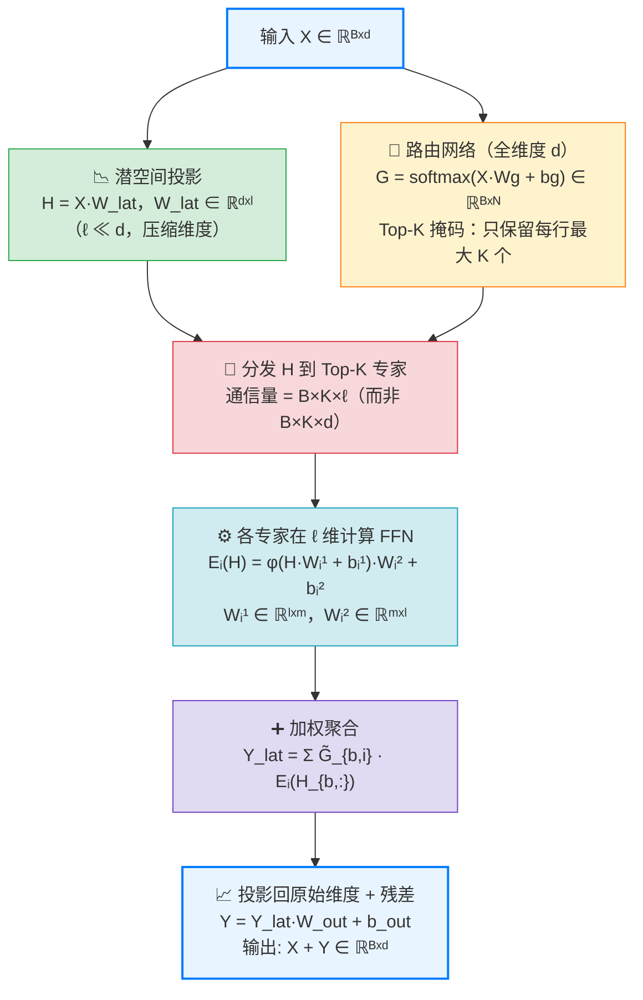

# LatentMoE：低维潜空间专家路由架构

> 原文：[Emergent Mind - LatentMoE Architecture](https://www.emergentmind.com/topics/latentmoe-architecture)  
> 核心论文：[NVIDIA Nemotron 3（arXiv 2512.20856）](https://arxiv.org/abs/2512.20856) / [Elango et al.（arXiv 2601.18089）](https://arxiv.org/abs/2601.18089)  
> 更新：2026-02

---

## 📚 目录

- [背景：从 Dense 到 MoE 的演进](#背景从-dense-到-moe-的演进)
- [标准 MoE 的瓶颈](#标准-moe-的瓶颈)
- [LatentMoE 的核心思路](#latentmoe-的核心思路)
- [架构细节](#架构细节)
- [数学公式](#数学公式)
- [硬件效率分析](#硬件效率分析)
- [理论保障：表达能力不降反升](#理论保障表达能力不降反升)
- [实际应用：Nemotron 3](#实际应用nemotron-3)
- [与其他 MoE 变体的比较](#与其他-moe-变体的比较)
- [关键洞察总结](#关键洞察总结)

---

## 背景：从 Dense 到 MoE 的演进

### Dense Transformer 的瓶颈

早期大语言模型（GPT-2、BERT、T5）全部采用 **Dense 架构**：每个 token 都经过所有参数的计算。随着规模增大，这带来了三个问题：

1. **计算成本随参数量线性增长** — 训练 175B GPT-3 需要数千张 A100
2. **推理延迟高** — 每个 token 都要激活全部参数
3. **参数利用率低** — 不同类型的 token 应当激活不同的"专家知识"

### Mixture-of-Experts（MoE）的出现

MoE 的核心想法来自 1991 年 Jacobs 等人的论文，2022 年被 **GLaM（Google）** 和 **Switch Transformer（Google Brain）** 大规模应用于 LLM：

- **稀疏激活**：每个 token 只经过 Top-K 个专家（FFN 子层），而非全部
- **参数规模 ≠ 计算量**：21B 总参数的模型每 token 只激活 3.6B（如 DeepSeek-V3）
- **等式**：`推理速度 ∝ 活跃参数` 而非 `总参数`

典型代表：

| 模型 | 总参数 | 每 token 激活 | 专家数 |
|------|--------|---------------|--------|
| Switch Transformer | 1.6T | 约 1/N | N个 |
| Mixtral 8x7B | 46.7B | 12.9B | 8个 |
| DeepSeek-V3 | 671B | 37B | 256个 |
| Llama 4 Scout | ~100B | 17B | 16个 |
| Nemotron 3 (LatentMoE) | 1T 级 | latent 压缩后更少 | 数百个 |

### 标准 MoE 还有哪些问题？

虽然 MoE 解决了计算效率问题，但**分布式训练和推理中**仍然有两个重要瓶颈，催生了 LatentMoE。

---

## 标准 MoE 的瓶颈

### 瓶颈 1：内存带宽限制（低 batch 场景）

在推理的 **低 batch** 情形（如单用户对话），GPU 的瓶颈在于 **权重读取速度**，而非计算速度（FLOP 利用率很低）。

标准 MoE 中，每个专家的 FFN 权重矩阵是 `d × m`（d = 隐层维度，m = FFN 中间维度）。要激活 K 个专家，就需要从显存读取 `K × d × m` 的权重数据。`d` 越大（如 8192），每次推理的带宽压力越大。

### 瓶颈 2：All-to-All 通信开销（高 throughput 场景）

在**多机推理**（如 Expert Parallelism）中，每个 token 需要被路由到分布在不同 GPU 上的 Top-K 个专家。这需要 **All-to-All 集合通信**，通信量与 token 的维度 `d` 成正比：

```
通信量 ∝ B × K × d
```

其中 B = batch size。随着 d 增大，跨节点通信成为严重瓶颈，常常导致 GPU 等待网络传输而空转。

**LatentMoE 的出发点**：如果能把 token 先压缩到低维 `ℓ ≪ d`，再分发给各专家，通信量就变成 `B × K × ℓ`，节省 `d/ℓ` 倍。

---

## LatentMoE 的核心思路

LatentMoE 引入一个 **低维潜空间（latent bottleneck）**，将标准 MoE 的专家计算从 `d` 维压缩到 `ℓ` 维：

```
原始 token (d维) → 投影 → 潜表示 (ℓ维) → 分发给专家 → 专家计算 (ℓ维) → 聚合 → 投影回 (d维)
```

**关键创新**：省下来的内存和带宽预算，用来**增加专家数量 N 和 fan-out K**：

```
N' = N × (d/ℓ)   # 专家数增加 d/ℓ 倍
K' = K × (d/ℓ)   # 每 token 激活的专家数也增加
```

这样做到：**通信/内存开销不变，但模型表达能力指数级提升**（可选专家组合数从 C(N,K) 增加到 C(N', K')）。

---

## 架构细节

LatentMoE 作为标准 MoE-FFN 子层的**直接替换**，在 Nemotron 3 的 Hybrid Mamba-Transformer 架构中使用。每个 LatentMoE 层的处理流程：



**注意**：路由网络仍在完整 `d` 维操作，保证路由决策的质量；只有专家计算和通信在 `ℓ` 维进行。

---

## 数学公式

### 路由

$$G = \text{softmax}(XW_g + b_g) \in \mathbb{R}^{B \times N}$$

<div>
$$\tilde{g}_i(x) = \begin{cases} g_i(x) & \text{if } i \in \text{TopK}(g(x)) \\ 0 & \text{otherwise} \end{cases}$$
</div>

### 潜空间投影

$$H = X W_{\text{lat}}, \quad W_{\text{lat}} \in \mathbb{R}^{d \times \ell}, \quad \ell \ll d$$

### 专家计算（全在 ℓ 维）

$$E_i(H_{b,:}) = \phi(H_{b,:} W_i^{(1)} + b_i^{(1)}) W_i^{(2)} + b_i^{(2)}$$

### 聚合与还原

$$Y_{\text{lat}, b} = \sum_{i=1}^{N} \tilde{G}_{b,i} E_i(H_{b,:})$$

$$Y = Y_{\text{lat}} W_{\text{out}} + b_{\text{out}}, \quad W_{\text{out}} \in \mathbb{R}^{\ell \times d}$$

### 负载均衡损失（继承自标准 MoE）

$$\mathcal{L}_{\text{load}} = \lambda_{\text{load}} N \sum_{j=1}^{N} P_j^2, \quad P_j = \frac{1}{B} \sum_{b=1}^{B} \tilde{g}_j(x_b)$$

---

## 硬件效率分析

| 指标 | 标准 MoE | LatentMoE |
|------|----------|-----------|
| 每专家权重大小 | `d × m` | `ℓ × m`（缩小 d/ℓ 倍） |
| All-to-All 通信量 | `B × K × d` | `B × K × ℓ`（缩小 d/ℓ 倍） |
| 专家数（固定预算下） | N | N × (d/ℓ) |
| 每 token 激活专家 | K | K × (d/ℓ)（可选） |

典型取值：`d = 8192，ℓ = 512`，压缩比 = 16×，专家数可以扩大 16 倍。

---

## 理论保障：表达能力不降反升

这是 LatentMoE 最关键的理论贡献：

### 非线性容量保持

每个 token 的非线性容量（函数逼近能力）约为 `K × m`（fan-out × 专家宽度）。在保持 K 和 m 不变的同时压缩维度时，容量保持不变；若同步扩大 K 和 m，容量进一步增加。

### 组合多样性指数增长

可能的专家组合数从 C(N, K) 增长到：

$$\binom{\alpha N}{\alpha K} \ge \binom{N}{K}^{\alpha}, \quad \alpha = d/\ell$$

即组合数以 **指数级**增长，意味着模型能处理的 token 专业化程度远超原始 MoE。

---

## 实际应用：Nemotron 3

NVIDIA 在 **Nemotron 3 系列**（Super 和 Ultra 两个规格，规模至万亿参数）中将 LatentMoE 用于 **Hybrid Mamba-Transformer 架构**：

- **主体**：Mamba-2 序列建模层（替代大部分 Attention，显著提升推理吞吐）
- **FFN 层**：全部替换为 LatentMoE
- **少量 Attention**：保留在特定位置维持全局信息路由

**实测效果**：
- 对比同参数量的 Transformer MoE，推理吞吐提升 **3.3×**（常规推理序列长度下）
- 在 FLOP 等价条件下，Pareto 前沿上的精度优于标准 MoE
- 验证规模：万亿参数级

---

## 与其他 MoE 变体的比较

| 架构 | 核心改进 | 代表模型 |
|------|----------|----------|
| Switch Transformer | 简化路由（Top-1），解决训练不稳定 | Google Switch-C |
| GShard | 分布式 MoE 扩展方案 | Google mT5 MoE |
| DeepSpeed-MoE | 层次化 MoE + 残差连接 | - |
| Mixtral 8×7B | 开源稀疏 MoE，Top-2 路由 | Mixtral |
| DeepSeek-V3 | 专家细粒化 + 辅助损失优化 | DeepSeek-V3 |
| **LatentMoE** | **低维潜空间，压缩通信/内存，指数扩专家** | **Nemotron 3** |

LatentMoE 的独特之处在于：它不是改进**路由策略**，而是改进**专家的表示维度**，是一种正交的优化维度。

---

## 关键洞察总结

1. **通信是分布式 MoE 的核心瓶颈**，而非 FLOP。LatentMoE 直接压缩通信维度。

2. **低维不意味着低质量**：路由决策仍在全维度 `d` 进行，保证了路由精度；只有被路由后的计算在 `ℓ` 维。

3. **"节省再投资"策略**：省出的预算不用于加速，而是用于扩大专家池，最终模型容量指数级提升。

4. **与 Mamba 结合的协同效应**：Mamba-2 解决了长上下文的序列建模效率，LatentMoE 解决了 FFN 层的专家扩展瓶颈，两者互补。

5. **适用场景**：既适合 **latency-critical**（低 batch，带宽受限）也适合 **high-throughput**（大 batch，通信受限），是少见的两种场景均有收益的设计。
