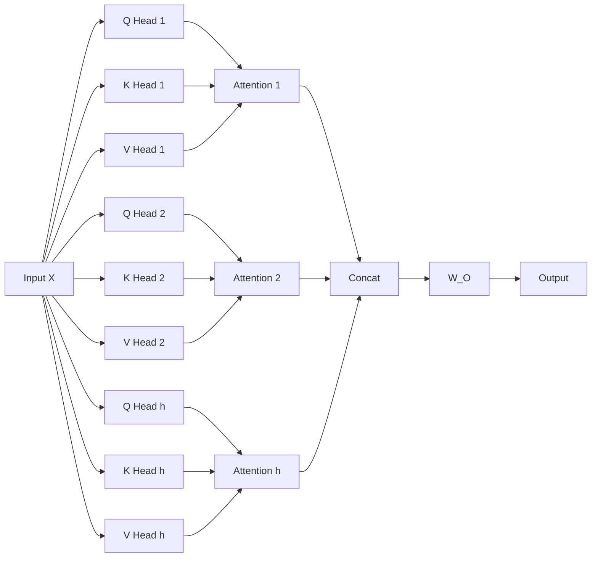
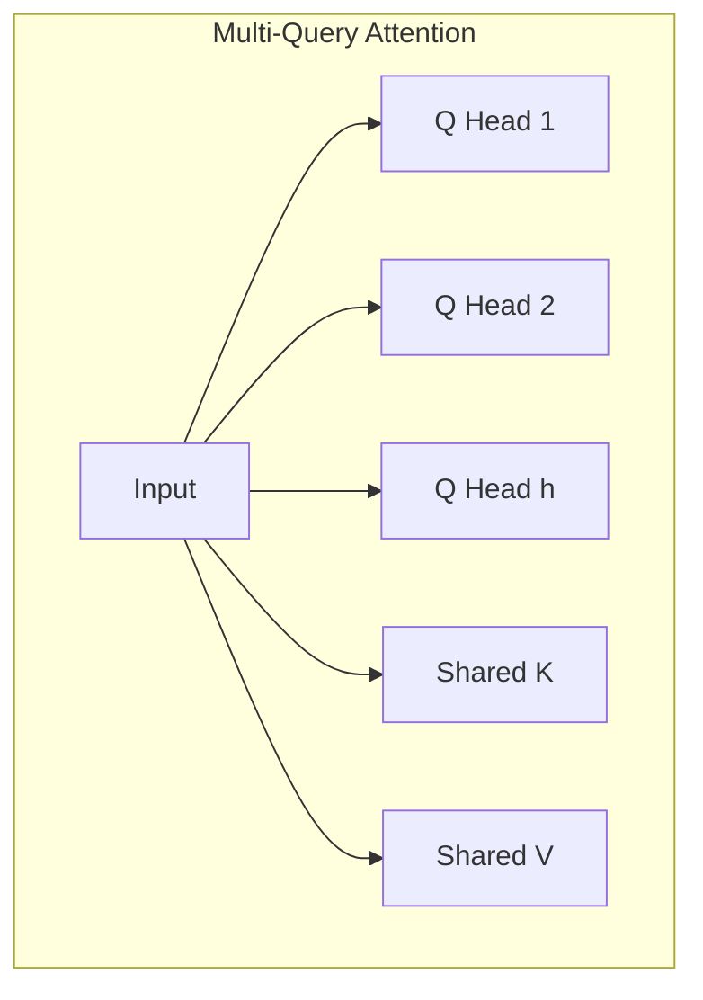
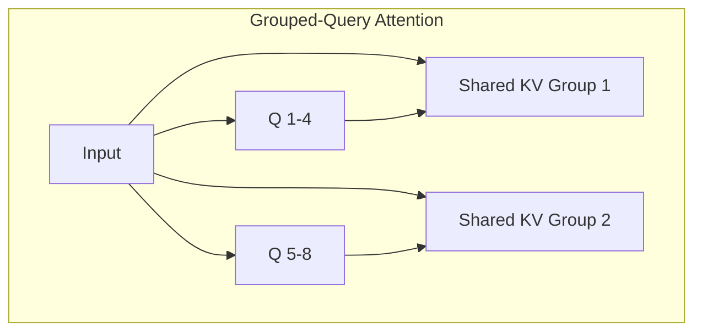
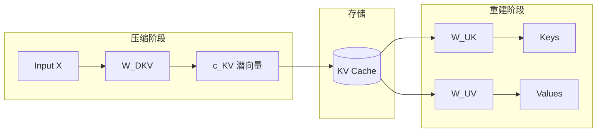
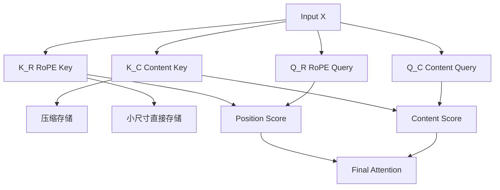
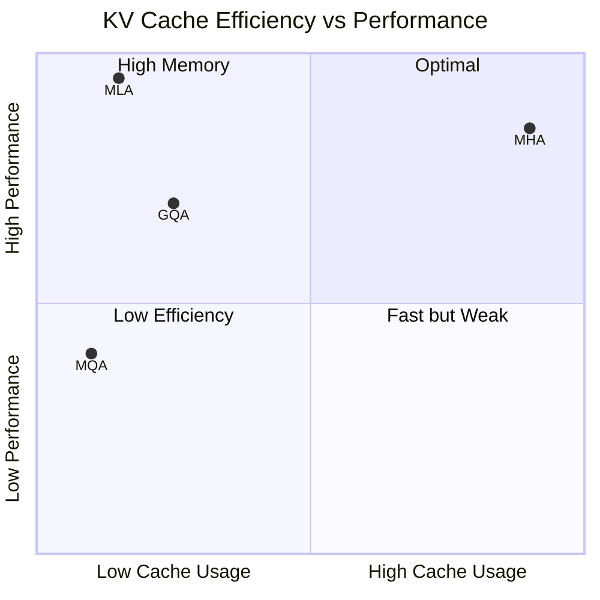

# Multi-Head Latent Attention (MLA): DeepSeek 高效推理的秘密

> **摘要**：Multi-Head Latent Attention (MLA) 是 DeepSeek 在 V2/V3 中引入的注意力机制创新，通过低秩压缩将 KV Cache 减少高达 93.3%，同时保持甚至超越标准 MHA 的性能。本文从注意力机制演进、MLA 核心原理、RoPE 兼容性解决方案三个维度深入解析这一技术突破。

---

## 1. 背景：注意力机制演进

### 1.1 标准缩放点积注意力

Transformer 架构的核心是注意力机制，通过 Query、Key、Value 三个向量计算：

**数学公式**：

```
Attention(Q, K, V) = softmax(QK^T / √d_k) × V
```

其中：
- **Query (Q)**：当前正在处理的 token 表示
- **Key (K)**：序列中每个 token 的表示
- **Value (V)**：每个 token 关联的信息

### 1.2 多头注意力 (MHA)



**MHA 特点**：
- 将 `d_model` 维度拆分为 `h` 个头
- 每个头的维度：`d_k = d_v = d_model / h`
- 每个头独立学习 `W_Q`, `W_K`, `W_V` 投影矩阵
- 输出拼接后通过 `W_O` 变换

### 1.3 推理瓶颈：KV Cache

推理时，LLM 需要存储历史 token 的 Key 和 Value 以避免重复计算：

**KV Cache 内存开销**：

```
Memory = 2 × n_heads × d_head × seq_length × batch_size × dtype_size
```

| 模型 | 参数 | 序列长度 | KV Cache 大小 |
|------|------|----------|---------------|
| Llama-7B | 32 heads, d=128 | 4K | ~2 GB |
| Llama-70B | 64 heads, d=128 | 4K | ~10 GB |
| GPT-4 级别 | 96 heads, d=128 | 32K | ~100+ GB |

**问题**：KV Cache 随序列长度线性增长，成为长上下文推理的主要瓶颈。

---

## 2. 注意力效率优化演进

### 2.1 Multi-Query Attention (MQA)



**机制**：所有注意力头共享**同一组** Key 和 Value

**优缺点**：

| 优点 | 缺点 |
|------|------|
| KV Cache 减少 h 倍 | 表达能力下降 |
| 推理速度提升 | 长程依赖建模能力弱 |
| - | 微调不稳定 |

### 2.2 Grouped-Query Attention (GQA)



**机制**：将头分组，组内共享 KV

**应用**：Llama 3、Mistral 7B

**平衡**：在 MQA 速度和 MHA 质量之间取得折中

### 2.3 方法对比

| 方法 | KV Cache 大小 | 性能 | 代表模型 |
|------|--------------|------|----------|
| MHA | `2 × h × d × L` | ★★★★★ | GPT-3 |
| MQA | `2 × d × L` | ★★★☆☆ | PaLM |
| GQA | `2 × G × d × L` | ★★★★☆ | Llama 3 |
| **MLA** | `2 × d_c × L` | ★★★★★+ | DeepSeek |

---

## 3. Multi-Head Latent Attention (MLA)

### 3.1 核心思想：低秩 KV 联合压缩

MLA 的核心创新：**不存储完整的 K 和 V，而是压缩到低维潜空间**。



**数学表示**：

```
# 压缩（训练和推理时）
c_KV = X × W_DKV        # W_DKV: [d_model, d_c], d_c << d_model

# 重建（推理时）
K = c_KV × W_UK         # W_UK: [d_c, n_heads × d_head]
V = c_KV × W_UV         # W_UV: [d_c, n_heads × d_head]
```

**压缩比**：

```
标准 MHA:  2 × n_heads × d_head = 2 × 64 × 128 = 16384
MLA:       d_c = 512 (示例)
压缩比:    16384 / 512 = 32x (减少 96.9%)
```

### 3.2 矩阵吸收优化

为避免推理时显式计算大型 K/V 矩阵，MLA 将投影矩阵合并：

#### Key 投影吸收

```
原始: Q = X × W_Q,  K = c_KV × W_UK
优化: Q' = X × (W_Q × W_UK)   # 预计算合并矩阵
```

#### Value 投影吸收

```
原始: O = Concat(heads) × W_O,  V = c_KV × W_UV  
优化: O = Concat(heads) × (W_UV × W_O)  # 预计算合并矩阵
```

**效果**：推理时只需存储 `c_KV`，无需显式计算 K 和 V。

### 3.3 Query 压缩

类似地，Query 也可压缩以减少**训练时**的激活内存：

```
c_Q = X × W_DQ          # 压缩
Q = c_Q × W_UQ          # 重建
```

> **注意**：Query 压缩不影响推理 KV Cache，因为 Query 是动态计算并丢弃的。

---

## 4. RoPE 兼容性挑战与解决方案

### 4.1 RoPE 工作原理

Rotary Position Embedding 通过旋转 Q/K 向量编码位置：

```
q'_m = R_m × q_m
k'_n = R_n × k_n
```

其中 `R_m` 是基于位置 `m` 的旋转矩阵。

### 4.2 为什么 RoPE 与基础 MLA 不兼容？

**问题 1：重计算成本**

若在重建后应用 RoPE：
```
K = c_KV × W_UK → K' = RoPE(K)
```
则每生成一个新 token，都需要解压并旋转所有历史 Key，破坏效率。

**问题 2：矩阵合并失败**

矩阵乘法不可交换：
```
W_Q × W_UK × RoPE ≠ W_Q × RoPE × W_UK
```
无法将 `W_UK` 合并到 `W_Q` 中。

### 4.3 解决方案：解耦旋转位置编码

MLA 使用**两组独立的 Key 和 Query**：



**两组 Key/Query**：

| 类型 | 用途 | 存储方式 |
|------|------|----------|
| **Content (K_C, Q_C)** | 语义内容注意力 | 压缩存储 |
| **RoPE (K_R, Q_R)** | 位置信息 | 小尺寸直接存储 |

**注意力分数计算**：

```
Score = softmax((Q_C × K_C^T + Q_R × K_R^T) / √d)
```

**KV Cache 组成**：
- `c_KV`：压缩的内容向量（小）
- `K_R`：RoPE Key（小）
- 总大小仍远小于标准 MHA

---

## 5. 性能分析

### 5.1 KV Cache 效率对比

| 模型类型 | 方法 | KV Cache 使用率 |
|----------|------|-----------------|
| Dense 7B | MHA | 100% (baseline) |
| Dense 7B | GQA-8 | 25% |
| Dense 7B | MLA | ~7% |
| MoE 16B | MHA | 100% |
| MoE 16B | MLA | **14%** |
| MoE 236B | MHA | 100% |
| MoE 236B | MLA | **4%** |

### 5.2 性能基准对比

| 基准测试 | MHA | GQA | MQA | MLA |
|----------|-----|-----|-----|-----|
| MMLU | ★★★★ | ★★★ | ★★☆ | ★★★★★ |
| HumanEval | ★★★★ | ★★★ | ★★☆ | ★★★★★ |
| GSM8K | ★★★★ | ★★★ | ★★☆ | ★★★★★ |
| 长文本理解 | ★★★★ | ★★★ | ★★ | ★★★★★ |

### 5.3 关键结论



> **结论**：与 MQA/GQA 以性能换速度不同，MLA 同时提升性能和效率。

---

## 6. 代码实现

### 6.1 MLA 核心层实现

```python
import torch
import torch.nn as nn
import torch.nn.functional as F
import math

class MultiHeadLatentAttention(nn.Module):
    """
    Multi-Head Latent Attention (MLA) 实现
    参考 DeepSeek-V2 架构
    """
    def __init__(
        self,
        d_model: int = 2048,
        n_heads: int = 16,
        d_head: int = 128,
        d_compress: int = 512,      # KV 压缩维度
        d_rope: int = 64,           # RoPE 维度
        dropout: float = 0.0,
    ):
        super().__init__()
        self.d_model = d_model
        self.n_heads = n_heads
        self.d_head = d_head
        self.d_compress = d_compress
        self.d_rope = d_rope
        self.scale = 1.0 / math.sqrt(d_head + d_rope)
        
        # Query 投影 (Content + RoPE)
        self.w_q_content = nn.Linear(d_model, n_heads * d_head, bias=False)
        self.w_q_rope = nn.Linear(d_model, n_heads * d_rope, bias=False)
        
        # KV 压缩投影
        self.w_kv_down = nn.Linear(d_model, d_compress, bias=False)
        
        # KV 重建投影 (吸收到计算中)
        self.w_k_up = nn.Linear(d_compress, n_heads * d_head, bias=False)
        self.w_v_up = nn.Linear(d_compress, n_heads * d_head, bias=False)
        
        # RoPE Key 投影 (小尺寸，不压缩)
        self.w_k_rope = nn.Linear(d_model, n_heads * d_rope, bias=False)
        
        # 输出投影
        self.w_o = nn.Linear(n_heads * d_head, d_model, bias=False)
        self.dropout = nn.Dropout(dropout)
        
        # 预计算 RoPE 频率
        self._init_rope()
    
    def _init_rope(self, max_seq_len: int = 8192, base: float = 10000.0):
        """初始化 RoPE 旋转频率"""
        inv_freq = 1.0 / (base ** (torch.arange(0, self.d_rope, 2).float() / self.d_rope))
        self.register_buffer("inv_freq", inv_freq)
    
    def _apply_rope(self, x: torch.Tensor, positions: torch.Tensor) -> torch.Tensor:
        """应用旋转位置编码"""
        # x: [B, n_heads, S, d_rope]
        seq_len = x.shape[2]
        
        # 计算旋转角度
        freqs = torch.einsum("i,j->ij", positions.float(), self.inv_freq)
        emb = torch.cat([freqs, freqs], dim=-1)  # [S, d_rope]
        
        cos = emb.cos().unsqueeze(0).unsqueeze(0)  # [1, 1, S, d_rope]
        sin = emb.sin().unsqueeze(0).unsqueeze(0)
        
        # 旋转
        x1, x2 = x[..., :self.d_rope//2], x[..., self.d_rope//2:]
        rotated = torch.cat([-x2, x1], dim=-1)
        
        return x * cos + rotated * sin
    
    def forward(
        self,
        x: torch.Tensor,
        kv_cache: dict = None,
        positions: torch.Tensor = None,
    ) -> tuple[torch.Tensor, dict]:
        """
        前向传播
        
        Args:
            x: 输入 [B, S, d_model]
            kv_cache: KV 缓存 {"c_kv": Tensor, "k_rope": Tensor}
            positions: 位置索引 [S]
        
        Returns:
            output: [B, S, d_model]
            new_kv_cache: 更新后的缓存
        """
        B, S, _ = x.shape
        
        if positions is None:
            positions = torch.arange(S, device=x.device)
        
        # ========== Query 计算 ==========
        q_content = self.w_q_content(x)  # [B, S, n_heads * d_head]
        q_rope = self.w_q_rope(x)        # [B, S, n_heads * d_rope]
        
        q_content = q_content.view(B, S, self.n_heads, self.d_head).transpose(1, 2)
        q_rope = q_rope.view(B, S, self.n_heads, self.d_rope).transpose(1, 2)
        
        # 对 Q_rope 应用 RoPE
        q_rope = self._apply_rope(q_rope, positions)
        
        # ========== KV 压缩 ==========
        c_kv = self.w_kv_down(x)          # [B, S, d_compress]
        k_rope = self.w_k_rope(x)         # [B, S, n_heads * d_rope]
        k_rope = k_rope.view(B, S, self.n_heads, self.d_rope).transpose(1, 2)
        k_rope = self._apply_rope(k_rope, positions)
        
        # ========== KV Cache 处理 ==========
        if kv_cache is not None:
            c_kv = torch.cat([kv_cache["c_kv"], c_kv], dim=1)
            k_rope = torch.cat([kv_cache["k_rope"], k_rope], dim=2)
        
        new_kv_cache = {"c_kv": c_kv, "k_rope": k_rope}
        
        # ========== KV 重建 ==========
        k_content = self.w_k_up(c_kv)    # [B, L, n_heads * d_head]
        v = self.w_v_up(c_kv)            # [B, L, n_heads * d_head]
        
        L = c_kv.shape[1]
        k_content = k_content.view(B, L, self.n_heads, self.d_head).transpose(1, 2)
        v = v.view(B, L, self.n_heads, self.d_head).transpose(1, 2)
        
        # ========== 注意力计算 ==========
        # Content attention: Q_c @ K_c^T
        attn_content = torch.matmul(q_content, k_content.transpose(-2, -1))
        
        # RoPE attention: Q_r @ K_r^T
        attn_rope = torch.matmul(q_rope, k_rope.transpose(-2, -1))
        
        # 合并并缩放
        attn_scores = (attn_content + attn_rope) * self.scale
        attn_probs = F.softmax(attn_scores, dim=-1)
        attn_probs = self.dropout(attn_probs)
        
        # 输出
        output = torch.matmul(attn_probs, v)  # [B, n_heads, S, d_head]
        output = output.transpose(1, 2).contiguous().view(B, S, -1)
        output = self.w_o(output)
        
        return output, new_kv_cache


# ========== 使用示例 ==========
if __name__ == "__main__":
    # 配置
    batch_size = 2
    seq_len = 128
    d_model = 2048
    
    # 创建 MLA 层
    mla = MultiHeadLatentAttention(
        d_model=d_model,
        n_heads=16,
        d_head=128,
        d_compress=512,   # 压缩到 512 维
        d_rope=64,
    )
    
    # 输入
    x = torch.randn(batch_size, seq_len, d_model)
    
    # 前向传播
    output, kv_cache = mla(x)
    print(f"Output shape: {output.shape}")  # [2, 128, 2048]
    print(f"KV Cache c_kv shape: {kv_cache['c_kv'].shape}")    # [2, 128, 512]
    print(f"KV Cache k_rope shape: {kv_cache['k_rope'].shape}")  # [2, 16, 128, 64]
    
    # 计算压缩比
    standard_kv = 2 * 16 * 128 * seq_len  # MHA KV Cache
    mla_kv = 512 * seq_len + 16 * 64 * seq_len  # c_kv + k_rope
    print(f"Compression ratio: {standard_kv / mla_kv:.2f}x")
```

---

## 7. 总结

### 7.1 MLA 核心创新

| 创新点 | 描述 | 效果 |
|--------|------|------|
| **低秩 KV 压缩** | 将 KV 投影到低维潜空间 | KV Cache 减少 90%+ |
| **矩阵吸收** | 合并投影矩阵避免显式重建 | 推理无额外计算 |
| **解耦 RoPE** | 分离内容和位置 Key/Query | 兼容旋转位置编码 |
| **Query 压缩** | 可选的 Query 压缩 | 减少训练激活内存 |

### 7.2 与其他方法对比

| 特性 | MHA | MQA | GQA | MLA |
|------|-----|-----|-----|-----|
| KV Cache | 100% | ~6% | ~12% | ~7% |
| 性能 | ★★★★★ | ★★★ | ★★★★ | ★★★★★ |
| 训练稳定性 | ★★★★★ | ★★★ | ★★★★ | ★★★★★ |
| 长上下文 | ★★★ | ★★ | ★★★ | ★★★★★ |

### 7.3 适用场景

- **推荐使用 MLA**：长上下文、内存受限、需要高性能
- **DeepSeek 系列**：V2、V3、R1 均采用 MLA
- **未来趋势**：有望成为新一代注意力机制标准

---

## 参考文献

| # | 论文 | 链接 |
|---|------|------|
| 1 | DeepSeek-V2: A Strong, Economical, and Efficient Mixture-of-Experts Language Model | [arXiv](https://arxiv.org/abs/2405.04434) |
| 2 | DeepSeek-V3 Technical Report | [arXiv](https://arxiv.org/abs/2412.19437) |
| 3 | GQA: Training Generalized Multi-Query Transformer Models from Multi-Head Checkpoints | [arXiv](https://arxiv.org/abs/2305.13245) |
| 4 | Fast Transformer Decoding: One Write-Head is All You Need | [arXiv](https://arxiv.org/abs/1911.02150) |
| 5 | RoFormer: Enhanced Transformer with Rotary Position Embedding | [arXiv](https://arxiv.org/abs/2104.09864) |

---

**原文链接**：[Deep-Diving & Decoding The Secrets That Make DeepSeek So Good](https://www.intoai.pub/p/multi-head-latent-attention-is-the)
