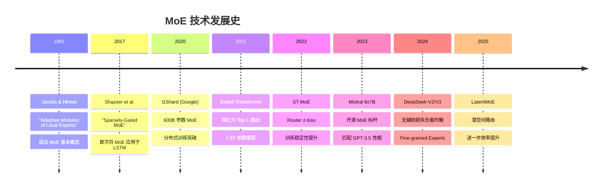
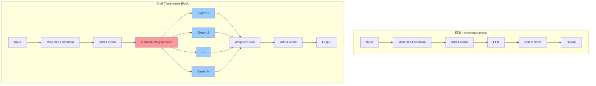
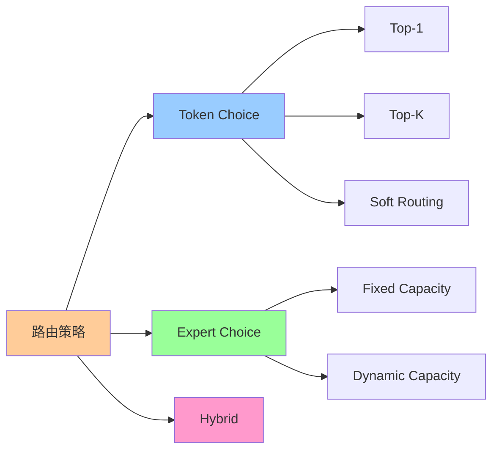
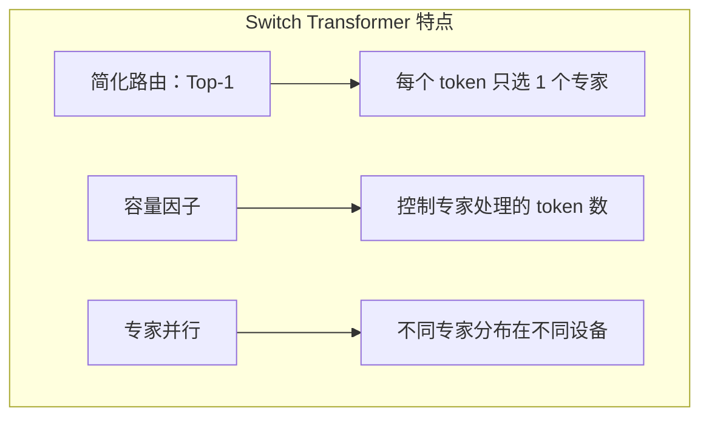
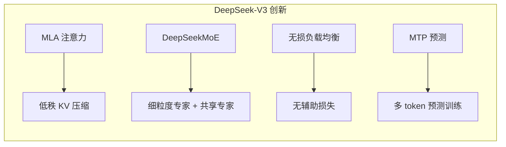
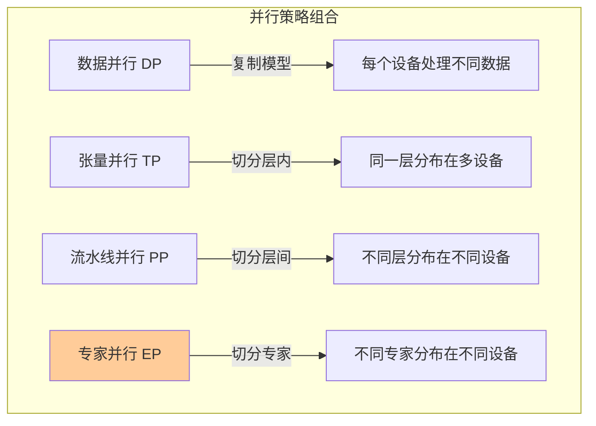
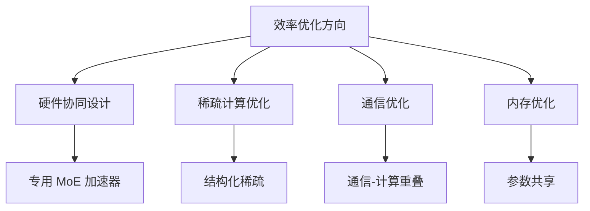

# Mixture of Experts (MoE) 完整技术综述

> 更新：2026-02
> 作者：chengenbao
> 关键词：MoE, Sparse Models, LLM Architecture, DeepSeek, Mixtral

## 📚 目录

- [1. 引言与背景](#1-引言与背景)
- [2. MoE 发展历程](#2-moe-发展历程)
- [3. MoE 核心架构](#3-moe-核心架构)
- [4. 路由机制详解](#4-路由机制详解)
- [5. 负载均衡策略](#5-负载均衡策略)
- [6. 代表性 MoE 模型](#6-代表性-moe-模型)
- [7. MoE 训练技术](#7-moe-训练技术)
- [8. MoE 推理优化](#8-moe-推理优化)
- [9. MoE vs Dense 模型对比](#9-moe-vs-dense-模型对比)
- [10. 未来发展方向](#10-未来发展方向)
- [11. 参考文献](#11-参考文献)

---

## 1. 引言与背景

### 1.1 为什么需要 MoE？

随着大语言模型（LLM）规模的不断扩大，传统的 Dense Transformer 面临三大核心挑战：

| 挑战 | 描述 | 影响 |
|------|------|------|
| **计算成本** | 每个 token 都需要经过所有参数 | 训练和推理成本呈平方级增长 |
| **内存瓶颈** | 模型参数量与显存占用成正比 | 限制了模型规模的进一步扩展 |
| **能效问题** | 大量参数在处理简单任务时被"浪费" | 能耗与碳排放持续增加 |

**MoE 的核心洞察**：研究发现，在 Dense Transformer 的 FFN 层中，对于任意输入，只有约 **5% 的神经元被显著激活**。这意味着 95% 的计算是"冗余"的。

### 1.2 MoE 的核心思想

**Mixture of Experts（混合专家模型）** 将这种稀疏激活特性显式化：

```
传统 Dense: 输入 → 所有参数 → 输出
MoE:       输入 → 路由器 → 选中的专家子集 → 输出
```

这种设计实现了：
- **参数量扩展**：可以拥有数千亿甚至万亿参数
- **计算量可控**：每次推理只激活一小部分参数
- **专业化分工**：不同专家可以学习不同类型的知识

---

## 2. MoE 发展历程

### 2.1 历史演进时间线



### 2.2 关键里程碑论文

| 年份 | 论文 | 核心贡献 |
|------|------|----------|
| 1991 | Adaptive Mixtures of Local Experts | 提出 MoE 基本框架和门控网络概念 |
| 2017 | Outrageously Large Neural Networks | 首次在超大规模模型中验证 MoE 有效性 |
| 2020 | GShard | 提出专家并行和负载均衡损失 |
| 2021 | Switch Transformer | 简化路由机制，证明 Top-1 足够有效 |
| 2022 | ST-MoE | 系统研究训练稳定性，提出 z-loss |
| 2023 | Mixtral 8x7B | 开源高质量 MoE，推动社区发展 |
| 2024 | DeepSeek-V3 | 无辅助损失负载均衡，训练成本大幅降低 |

---

## 3. MoE 核心架构

### 3.1 整体架构

MoE 通常替换 Transformer 中的 FFN 层：



### 3.2 核心组件

#### 3.2.1 专家网络（Experts）

每个专家通常是一个标准的 FFN：

$$\text{Expert}_i(x) = W_2^{(i)} \cdot \text{GELU}(W_1^{(i)} \cdot x)$$

其中：
- $W_1^{(i)} \in \mathbb{R}^{d_{model} \times d_{ff}}$：上投影矩阵
- $W_2^{(i)} \in \mathbb{R}^{d_{ff} \times d_{model}}$：下投影矩阵
- $d_{ff}$ 通常为 $4 \times d_{model}$

#### 3.2.2 路由器/门控网络（Router/Gating Network）

路由器决定每个 token 应该被哪些专家处理：

$$G(x) = \text{softmax}(x \cdot W_g)$$

其中 $W_g \in \mathbb{R}^{d_{model} \times N}$，$N$ 是专家数量。

#### 3.2.3 MoE 层输出

$$\text{MoE}(x) = \sum_{i \in \text{TopK}} G(x)_i \cdot \text{Expert}_i(x)$$

### 3.3 参数量与计算量分析

| 指标 | Dense FFN | MoE Layer |
|------|-----------|-----------|
| **总参数量** | $2 \times d_{model} \times d_{ff}$ | $N \times 2 \times d_{model} \times d_{ff}$ |
| **激活参数量** | $2 \times d_{model} \times d_{ff}$ | $K \times 2 \times d_{model} \times d_{ff}$ |
| **参数放大倍数** | 1x | N/K x |

**示例**：Mixtral 8x7B
- 总参数：46.7B（8 个 7B 专家）
- 激活参数：12.9B（每次激活 2 个专家）
- 参数效率：3.6x

---

## 4. 路由机制详解

### 4.1 路由策略分类



### 4.2 Token Choice Routing（主流方法）

每个 token 选择 Top-K 个专家：

```python
def token_choice_routing(x, W_g, K=2):
    """
    x: [batch_size, seq_len, d_model]
    W_g: [d_model, num_experts]
    """
    # 计算路由分数
    logits = x @ W_g  # [B, S, E]
    
    # 添加噪声（训练时）
    noise = torch.randn_like(logits) * softplus(W_noise @ x)
    logits = logits + noise
    
    # Top-K 选择
    topk_values, topk_indices = torch.topk(logits, K, dim=-1)
    
    # 计算门控权重（归一化）
    gates = F.softmax(topk_values, dim=-1)
    
    return gates, topk_indices
```

### 4.3 Expert Choice Routing

专家选择自己要处理的 token（EC routing）：

```python
def expert_choice_routing(x, W_g, capacity_factor=1.0):
    """
    每个专家选择固定数量的 token
    """
    B, S, D = x.shape
    E = W_g.shape[1]
    
    # 计算亲和度分数
    scores = x @ W_g  # [B, S, E]
    scores = scores.transpose(1, 2)  # [B, E, S]
    
    # 每个专家的容量
    capacity = int(capacity_factor * S / E)
    
    # 每个专家选择 top-capacity 个 token
    topk_scores, topk_indices = torch.topk(scores, capacity, dim=-1)
    
    return topk_scores, topk_indices
```

**对比**：

| 特性 | Token Choice | Expert Choice |
|------|--------------|---------------|
| 负载均衡 | 需要辅助损失 | 天然均衡 |
| Token 覆盖 | 完全覆盖 | 可能漏掉 token |
| 实现复杂度 | 简单 | 较复杂 |
| 代表模型 | Mixtral, DeepSeek | GLaM, Expert Choice Paper |

### 4.4 噪声注入机制

为了鼓励探索和负载均衡，通常在路由分数中添加噪声：

$$\text{logits}_{\text{noisy}} = \text{logits} + \epsilon \cdot \text{Softplus}(x \cdot W_{\text{noise}})$$

其中 $\epsilon \sim \mathcal{N}(0, 1)$。

---

## 5. 负载均衡策略

### 5.1 为什么需要负载均衡？

没有负载均衡机制，MoE 会出现 **专家坍塌（Expert Collapse）** 问题：


### 5.2 辅助负载均衡损失

#### 5.2.1 标准负载均衡损失（GShard/Switch Transformer）

$$\mathcal{L}_{\text{balance}} = \alpha \cdot N \cdot \sum_{i=1}^{N} f_i \cdot P_i$$

其中：
- $f_i$：专家 $i$ 处理的 token 比例
- $P_i$：专家 $i$ 的平均路由概率
- $\alpha$：平衡系数（通常 0.01）
- $N$：专家数量

**直觉**：惩罚"既被选中多，又有高概率"的专家。

#### 5.2.2 Router z-loss（ST-MoE）

$$\mathcal{L}_z = \frac{1}{B} \sum_{b=1}^{B} \left( \log \sum_{i=1}^{N} e^{z_i^{(b)}} \right)^2$$

**作用**：防止路由 logits 过大导致的数值不稳定。

### 5.3 无辅助损失负载均衡（DeepSeek-V3 创新）

DeepSeek-V3 提出了革命性的 **Auxiliary-Loss-Free Load Balancing**：

```python
class LossFreeBalancing:
    def __init__(self, num_experts, update_rate=0.01):
        self.biases = torch.zeros(num_experts)
        self.update_rate = update_rate
    
    def forward(self, logits, training=True):
        # 添加专家偏置
        biased_logits = logits + self.biases
        
        # Top-K 选择
        gates, indices = self.topk_routing(biased_logits)
        
        if training:
            # 统计各专家负载
            expert_loads = self.compute_loads(indices)
            avg_load = expert_loads.mean()
            
            # 动态调整偏置：负载高的降低，负载低的提高
            self.biases -= self.update_rate * (expert_loads - avg_load)
        
        return gates, indices
```

**优势**：
1. 不干扰主损失函数的梯度
2. 无需调节辅助损失权重
3. 训练更稳定，性能更好

---

## 6. 代表性 MoE 模型

### 6.1 模型对比总览

| 模型 | 发布时间 | 总参数 | 激活参数 | 专家数 | Top-K | 特色 |
|------|----------|--------|----------|--------|-------|------|
| **Switch Transformer** | 2021.01 | 1.6T | ~200B | 128-2048 | 1 | 首个万亿参数模型 |
| **GLaM** | 2021.12 | 1.2T | 96.6B | 64 | 2 | 高效训练 |
| **ST-MoE** | 2022.02 | 269B | 32B | 64 | 2 | 稳定训练技术 |
| **Mixtral 8x7B** | 2023.12 | 46.7B | 12.9B | 8 | 2 | 开源标杆 |
| **DeepSeek-V2** | 2024.05 | 236B | 21B | 160 | 6 | MLA + DeepSeekMoE |
| **DeepSeek-V3** | 2024.12 | 671B | 37B | 256 | 8 | 无损负载均衡 |
| **Mixtral 8x22B** | 2024.04 | 176B | 39B | 8 | 2 | 更大版本 |

### 6.2 Switch Transformer

Google 提出的里程碑式模型：



**核心创新**：
- 证明 Top-1 路由足够有效
- 提出容量因子（Capacity Factor）概念
- 系统的专家并行策略

### 6.3 Mixtral 8x7B

Mistral AI 开源的高质量 MoE 模型：

```
架构细节：
├── 层数: 32
├── 隐藏维度: 4096
├── 注意力头: 32
├── KV 头: 8 (GQA)
├── 专家数: 8
├── 激活专家: 2
├── 专家 FFN 维度: 14336
├── 上下文长度: 32K
└── 词表大小: 32000
```

**性能亮点**：
- 大多数任务匹配或超越 Llama 2 70B
- 推理速度比等效 Dense 模型快 6x
- 支持多语言和代码生成

### 6.4 DeepSeek-V3

目前最先进的开源 MoE 模型之一：



**训练细节**：
- 训练数据：14.8T tokens
- 训练成本：约 $5.5M（2.79M GPU hours）
- 对比：同级别模型通常需要 $50M+

---

## 7. MoE 训练技术

### 7.1 分布式训练策略



### 7.2 专家并行（Expert Parallelism）

```python
# All-to-All 通信示意
def expert_parallel_forward(x, gates, expert_indices):
    """
    x: [batch, seq, dim] - 本地数据
    gates: [batch, seq, K] - 门控权重
    expert_indices: [batch, seq, K] - 选中的专家 ID
    """
    # 1. Dispatch: 将 token 发送到对应专家所在的设备
    dispatched_x = all_to_all_dispatch(x, expert_indices)
    
    # 2. 本地专家计算
    expert_outputs = local_experts(dispatched_x)
    
    # 3. Combine: 将结果收集回原设备
    combined_outputs = all_to_all_combine(expert_outputs)
    
    # 4. 加权求和
    output = (combined_outputs * gates.unsqueeze(-1)).sum(dim=2)
    
    return output
```

### 7.3 训练稳定性技术

| 技术 | 描述 | 效果 |
|------|------|------|
| **Router z-loss** | 惩罚过大的路由 logits | 防止数值溢出 |
| **Expert Dropout** | 随机关闭部分专家 | 提高泛化性 |
| **Jitter Noise** | 输入添加小噪声 | 避免专家坍塌 |
| **Gradient Clipping** | 梯度裁剪 | 稳定训练 |
| **BFloat16** | 混合精度训练 | 保持数值稳定 |

### 7.4 容量因子与 Token Dropping

```python
def apply_capacity_constraint(expert_mask, capacity_factor=1.25):
    """
    expert_mask: [batch*seq, num_experts] - 每个 token 选择的专家
    capacity_factor: 专家容量倍数
    """
    B_S, E = expert_mask.shape
    capacity = int(capacity_factor * B_S / E)
    
    # 统计每个专家被选中的次数
    expert_counts = expert_mask.sum(dim=0)
    
    # 超出容量的 token 被丢弃
    position_in_expert = (expert_mask.cumsum(dim=0) - 1) * expert_mask
    overflow_mask = position_in_expert >= capacity
    
    # 丢弃溢出的 token
    expert_mask = expert_mask * (~overflow_mask)
    
    return expert_mask
```

---

## 8. MoE 推理优化

### 8.1 推理挑战

MoE 推理面临独特的挑战：

| 挑战 | 原因 | 影响 |
|------|------|------|
| **显存占用大** | 需要加载所有专家参数 | 无法在消费级 GPU 运行 |
| **内存带宽瓶颈** | 专家切换需要读取不同参数 | 降低推理速度 |
| **通信开销** | 分布式部署时的 All-to-All | 增加延迟 |

### 8.2 专家卸载（Expert Offloading）

将未使用的专家卸载到 CPU 或 SSD：

```python
class ExpertOffloadingMoE:
    def __init__(self, num_experts, gpu_experts=2):
        self.cpu_experts = [Expert() for _ in range(num_experts)]
        self.gpu_cache = LRUCache(capacity=gpu_experts)
    
    def forward(self, x, expert_indices):
        # 预测并预加载可能需要的专家
        for idx in expert_indices.unique():
            if idx not in self.gpu_cache:
                # 异步加载专家到 GPU
                expert = self.cpu_experts[idx].to('cuda', non_blocking=True)
                self.gpu_cache.put(idx, expert)
        
        # 执行计算
        outputs = []
        for idx in expert_indices:
            expert = self.gpu_cache.get(idx)
            outputs.append(expert(x))
        
        return outputs
```

### 8.3 推测解码（Speculative Decoding for MoE）


### 8.4 量化技术

| 量化方法 | 精度 | 显存节省 | 性能影响 |
|----------|------|----------|----------|
| FP16 | 16-bit | 2x | 几乎无损 |
| INT8 | 8-bit | 4x | 轻微下降 |
| INT4 | 4-bit | 8x | 明显下降 |
| GPTQ | 4-bit | 8x | 较小下降 |
| AWQ | 4-bit | 8x | 较小下降 |

---

## 9. MoE vs Dense 模型对比

### 9.1 全面对比

| 维度 | Dense 模型 | MoE 模型 |
|------|------------|----------|
| **参数效率** | 低（所有参数都激活） | 高（稀疏激活） |
| **训练速度** | 正常 | 更快（同等计算量下） |
| **推理延迟** | 可预测 | 较高变异性 |
| **显存需求** | 与激活参数成正比 | 与总参数成正比 |
| **扩展性** | 线性 | 接近对数 |
| **实现复杂度** | 简单 | 较复杂 |
| **硬件利用率** | 高 | 中等（通信开销） |

### 9.2 何时选择 MoE？

✅ **适合使用 MoE 的场景**：
- 需要超大规模模型能力
- 训练预算有限
- 任务多样性高
- 可以接受较高的显存占用

❌ **不适合使用 MoE 的场景**：
- 边缘设备部署
- 严格的延迟要求
- 显存受限环境
- 单一任务场景

### 9.3 性能-成本曲线

```
性能
  ↑
  │                    ★ MoE-671B (DeepSeek-V3)
  │              ★ Dense-405B (Llama-3)
  │         ★ MoE-47B (Mixtral)
  │    ★ Dense-70B (Llama-2)
  │ ★ Dense-7B
  │
  └─────────────────────────────→ 训练成本

MoE 在性能/成本比上具有显著优势
```

---

## 10. 未来发展方向

### 10.1 架构创新

1. **LatentMoE**：在低维潜空间进行路由，减少计算量
2. **Soft MoE**：全可微路由，无 token dropping
3. **Hierarchical MoE**：多层级专家组织
4. **Mixture of Depths**：动态选择处理的层数

### 10.2 效率优化



### 10.3 应用拓展

- **多模态 MoE**：图像、文本、音频专家
- **领域专家**：法律、医疗、代码等领域专家
- **终身学习**：动态添加新专家
- **个性化模型**：用户特定专家

---

## 11. 参考文献

### 11.1 经典论文

1. Jacobs, R. A., et al. (1991). **"Adaptive Mixtures of Local Experts"**. Neural Computation.

2. Shazeer, N., et al. (2017). **"Outrageously Large Neural Networks: The Sparsely-Gated Mixture-of-Experts Layer"**. ICLR.

3. Lepikhin, D., et al. (2020). **"GShard: Scaling Giant Models with Conditional Computation and Automatic Sharding"**. arXiv.

4. Fedus, W., et al. (2021). **"Switch Transformers: Scaling to Trillion Parameter Models with Simple and Efficient Sparsity"**. JMLR.

5. Zoph, B., et al. (2022). **"ST-MoE: Designing Stable and Transferable Sparse Expert Models"**. arXiv.

### 11.2 最新进展

6. Jiang, A. Q., et al. (2024). **"Mixtral of Experts"**. arXiv.

7. DeepSeek-AI. (2024). **"DeepSeek-V2: A Strong, Economical, and Efficient Mixture-of-Experts Language Model"**. arXiv.

8. DeepSeek-AI. (2024). **"DeepSeek-V3 Technical Report"**. arXiv.

9. Liu, J., et al. (2024). **"A Survey on Inference Optimization Techniques for Mixture of Experts Models"**. arXiv.

### 11.3 实现资源

- [Hugging Face Transformers MoE](https://huggingface.co/docs/transformers/model_doc/mixtral)
- [DeepSeek-V3 GitHub](https://github.com/deepseek-ai/DeepSeek-V3)
- [Mixtral Offloading](https://github.com/dvmazur/mixtral-offloading)
- [Megablocks](https://github.com/databricks/megablocks)

---

## 总结

Mixture of Experts 代表了大模型发展的一个重要方向：**通过稀疏激活实现参数规模与计算效率的解耦**。从 1991 年的理论提出，到 2024 年 DeepSeek-V3 的工程突破，MoE 已经从学术概念演变为实用的产业技术。

**核心要点回顾**：

| 方面 | 要点 |
|------|------|
| **架构** | 多专家 + 门控网络，稀疏激活 |
| **路由** | Top-K Token Choice 为主流 |
| **负载均衡** | 从辅助损失到无损均衡演进 |
| **训练** | 专家并行 + All-to-All 通信 |
| **推理** | 卸载、量化、推测解码 |

随着硬件和算法的持续进步，MoE 有望成为未来超大规模 AI 系统的标准架构。

---

*本文由 AI 辅助生成，最后更新于 2026 年 2 月*
